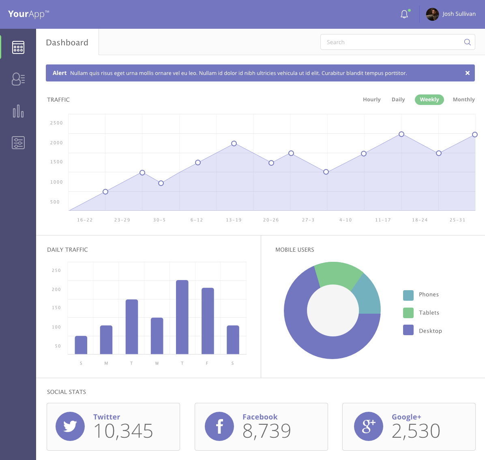

# WebApp Dashboard

## Instruction

A Web Dashboard template created from vanilla HTML, CSS, and ES6 using a supplied photo mockup. The dashboard uses a CSS grid and a flexbox as a layout tool. The dashboard is integrated with Javascript powered charts and graphs. Other functionalities such as users and blogs are not implemented. This project is created as a training project with Team Treehouse.
